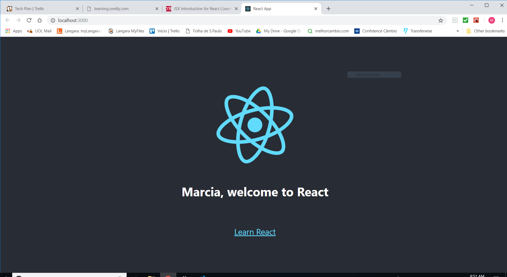

<br>
### Week 2

This week I started watching the learning path "Building a React App from Scratch" by Ally MacDonald.

#### Topics covered so far:
- Exploring some text editors: <br> Atom and VS Code were suggested by the instructor
- Installing React Developer Tools on Chrome: <br> Simply adding an extention to Chrome
- Creating my first React application using CLI commands:

```

  npm install -g create-react-app
  create-react-app notepad

  cd notepad
  npm start

```

* JSX introduction for React: <br>Embedding an external object's property inside an existing component. In the tutorial example, we added the **user** object's **name** property into the App component, which resulted in a Welcome Page with the user's name. 


#### Roadblocks
- The code of the initial example pages used in the tutorial were slightly different from the current examples available at React website, which required some adaptations from my part.
- The explanations about JSX in the tutorial were very superficial and not enough to understand it's concept. I had to look into React documentation files to have a better idea of what I was really doing.

#### Next steps
- Learn about stateless and stateful components in React
- Learn about State and Props in React
- Learn about Component Planning in React
