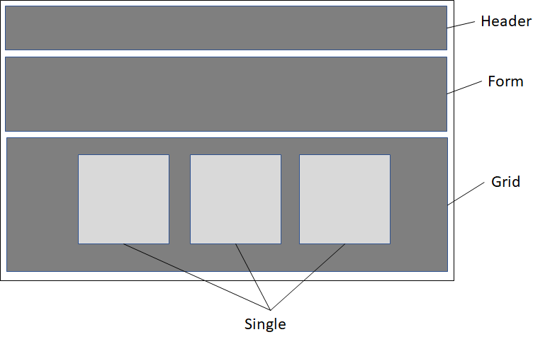

### Week 3

I continued watching the learning path ["Building a React App from Scratch"](https://www.safaribooksonline.com/learning-paths/learning-path-building/9781491991794) by Ally MacDonald available at Safari Books Online.<br>
Topics covered this week: 

- Stateless and stateful components in React
- State and Props in React
- Component Planning in React

 Based on the basic wireframe of the application, we created a **Components** folder with 4 components in it: **Form, Grid, Header, Single**. 
 
 

 
 
 Then we started coding the basic structure for each of those components.
 
 At this point the instructor made many typo mistakes that made us go back and forth many times, making it confusing to understand what was going on.
 So I decided to stop coding along with the instructor and just watch the whole tutorial.

#### Roadblocks
 
- After creating a Git repository for my project, I got an error message when trying to start the application with npm start: ```'react-scripts' is not recognized as an internal or external command```
 
After trying many commands, got this solution taken from [Stackoverflow](https://stackoverflow.com/questions/48942639/react-scripts-is-not-recognized-as-an-internal-or-external-command-operable-p?rq=1): Just running the command: 
`npm install react-scripts -g`

Then it started working again… 

- I experienced problems accessing the Safari Books Online for some time. Apparently they were having some problems in their website, which caused me some delay.
 
 
#### Next Steps
 
 Try to retake the tutorial from the point I stopped and finish coding the notepad application, which would include:
 - Use CSS in React
 - Setup Firebase to store data
 - Implement Read/Create/Delete notes functionality
