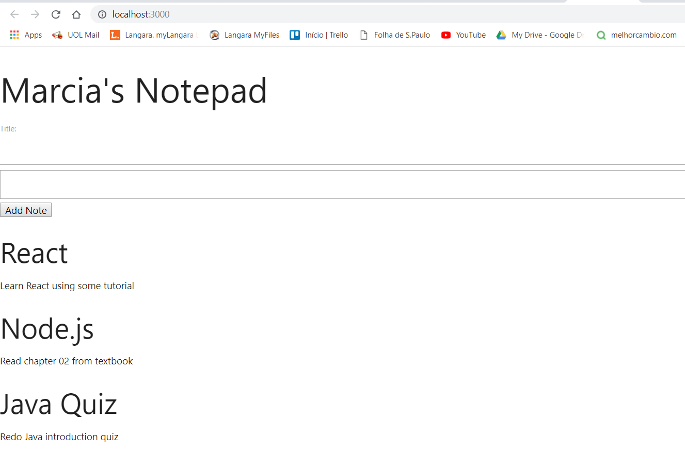
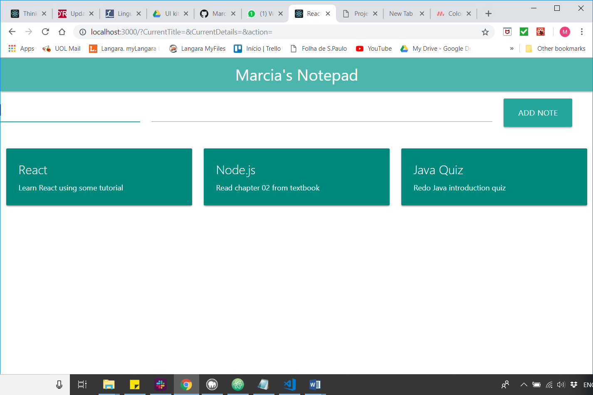

### Week 4

Watched the learning path ["Building a React App from Scratch"](https://www.safaribooksonline.com/learning-paths/learning-path-building/9781491991794) videos by Ally MacDonald once again.  

Items accomplished this week: 

 1.	Using SetState to update the state of an object: Updated the App component, which is a stateful component, with some states. The state structure included the following properties:
    * Name
    * An array of notes objects, each one with their own `id`, `title` and `description`. Added 3 random notes just for illustration purposes.
    * `handleEvent` and `handleChange` functions

2. Creating forms using React: created a form as a stateful component, which received objects and functions from the App component through props object.

Raw look of the Notepad application:

 

3.	Introducing CSS to a React project: used Materialize library to quickly add styles to the components

Notepad application after applying Materialize styles:
 
 

#### Roadblocks
 
Trying to learn React by just watching the Learning Path videos was quite confusing because there were many important conceptual definitions missing. There were lots of things going on and it was very hard to follow. So, I decided to take a look at the React documentation and follow their tutorial as well, as a way to get extra support and get things more clear. 
After having a very brief look at React documentation and tutorials, the Learning Path became pretty easier to grasp.
 
 
#### Next Steps
 
- Setup Firebase to store data
- Implement Read/Create/Delete notes functionality
- Write tutorial

