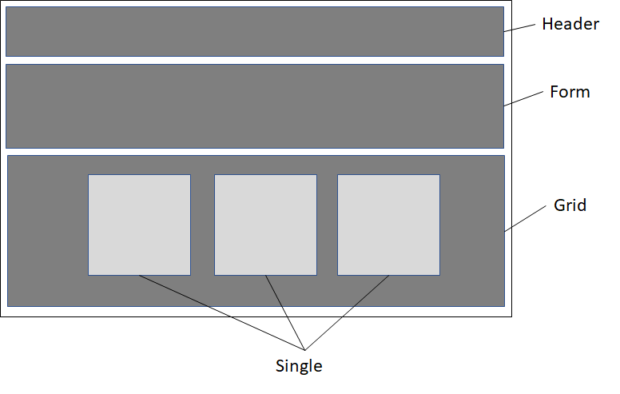

### Week 4

Trying to learn React by just watching the Learning Path videos was quite confusing because there were many important conceptual definitions missing. There were lots of things going on and it was very hard to follow. So, I decided to take a look at the React documentation and follow their tutorial as well, as a way to get extra support and get things more clear.
After having a very superficial look at React documentation and tutorials, the Learning Path became pretty easier to grasp.

Watched the learning path ["Building a React App from Scratch"](https://www.safaribooksonline.com/learning-paths/learning-path-building/9781491991794) videos by Ally MacDonald once again. <br>

Items accomplished this week: 

 1.	Using SetState to update the state of an object: Updated the App component, which is a stateful component, with some states. The state structure included the following properties:
    * Name
    * An array of notes objects, each one with their own id, title and description. Added 3 random notes just for illustration purposes.
    * `handleEvent` and `handleChange` functions

2. Creating forms using React: created a form as a stateful component, which received objects and functions from the App component through props object.

3.	Introducing CSS to a React project: used Materialize library to quickly add styles to the components
 
 Based on the basic wireframe of the application, we created a **Components** folder with 4 components in it: **Form, Grid, Header, Single**. 
 
 


#### Roadblocks
 
- After creating a Git repository for my project, I got an error message when trying to start the application with npm start: ```'react-scripts' is not recognized as an internal or external command```
 
After trying many commands, got this solution taken from [Stackoverflow](https://stackoverflow.com/questions/48942639/react-scripts-is-not-recognized-as-an-internal-or-external-command-operable-p?rq=1): Just running the command: 
`npm install react-scripts -g`

Then it started working again… 

- I experienced problems accessing the Safari Books Online for some time. Apparently they were having some problems in their website, which caused me some delay.
 
 
#### Next Steps
 
 Try to retake the tutorial from the point I stopped and finish coding the notepad application, which would include:
 - Use CSS in React
 - Setup Firebase to store data
- Implement Read/Create/Delete notes functionality
