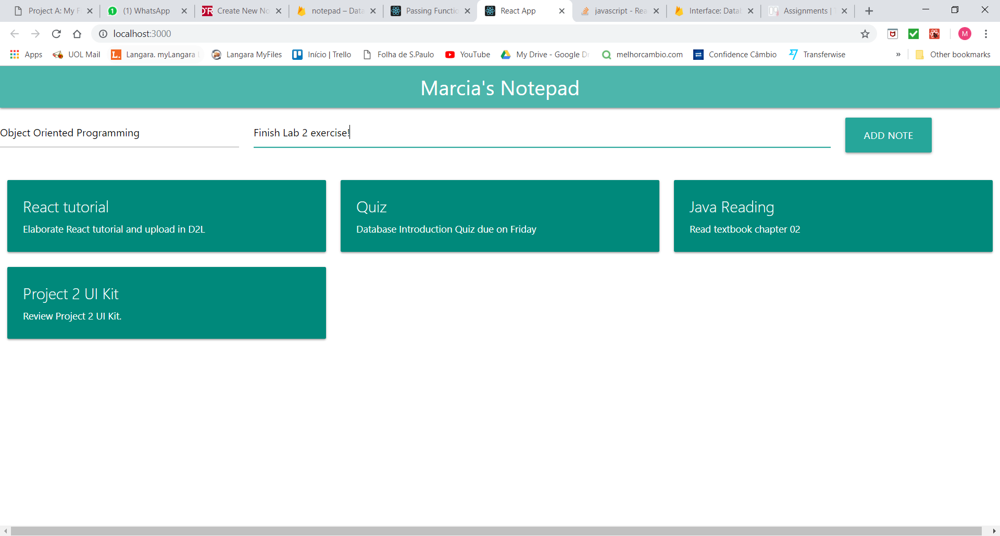
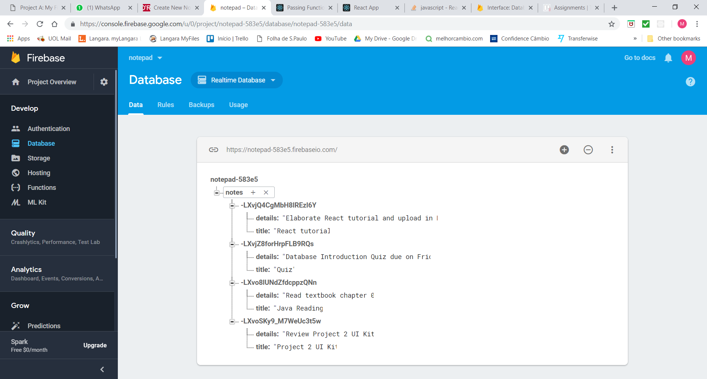

### Week 5

Finally I could finish building my React application, based on the learning path ["Building a React App from 
Scratch"](https://www.safaribooksonline.com/learning-paths/learning-path-building/9781491991794) by Ally MacDonald.  

With the basic application up and running, I could elaborate the Tutorial document.

Items accomplished this week: 

1. Initial setup for Firebase (cloud database)
 
2. Creating new notes in the notepad, storing data into the database using Firebase functions

3. Retrieve created notes from Firebase

4. Delete notes from notepad and reflecting on Firebase database on real time.

Final look of the application after connecting to Firebase:
 
 
 
Visualizing changes in data reflected in Firebase website:
 

#### Roadblocks
 
Trying to learn React by just watching the Learning Path videos was quite confusing because there were many important conceptual definitions missing. There were lots of things going on and it was very hard to follow. So, I decided to take a look at the React documentation and follow their tutorial as well, as a way to get extra support and get things more clear. 
After having a very brief look at React documentation and tutorials, the Learning Path became pretty easier to grasp.
 
 
#### Next Steps
 
- Setup Firebase to store data
- Implement Read/Create/Delete notes functionality
- Write tutorial

