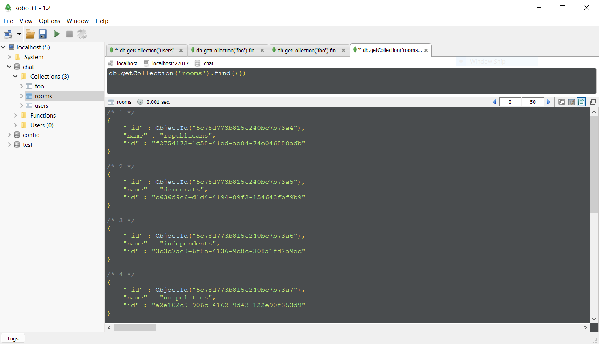

### Week 9

Created a new js file named import.rooms.js to try some initial commands to access MongoDB via driver.

* Accomplishments:
  - Installed MondoDB driver for Nodejs
  - Successfuly connected the demo chat room application with a MongoDB local server
  - Wrote a function retrieving data (user data) from a MongoDB collection
  - Wrote another function that inserted documents into a MongoDB collection. Used insertMany method of the collection object to insert many documents at once, passing a JSON file containing an array of objects (chat rooms).
  - Checked the results using Robomongo GUI
  
  

* Road blocks
  - Apparently the mongoDB driver used in the learning path of the tutorial is deprecated. When I tried to run the commands according to the instructions, I would get errors. I could only complete the intended tasks by adapting the code with the instructions given by the official MongoDB documentation.
  - As expected, the fact that I don't master the Node.js commands, make it a little more difficult to understand the code. I had to complement my studies by reading the Nodejs documentation as well.
  
* Next steps
  - Implement the other CRUD operations: DELETE and UPDATE.
